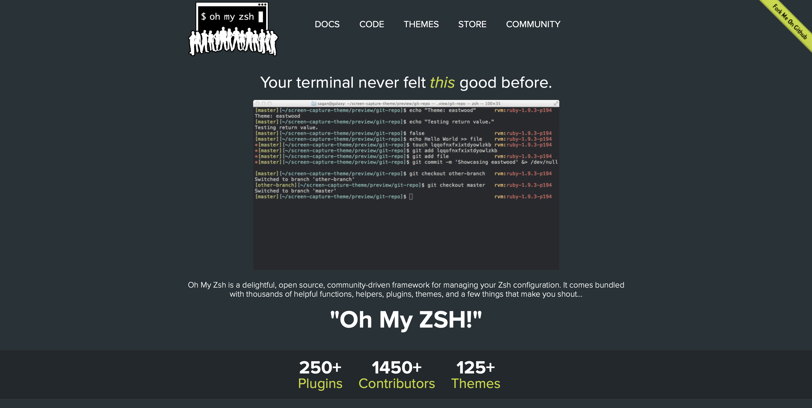
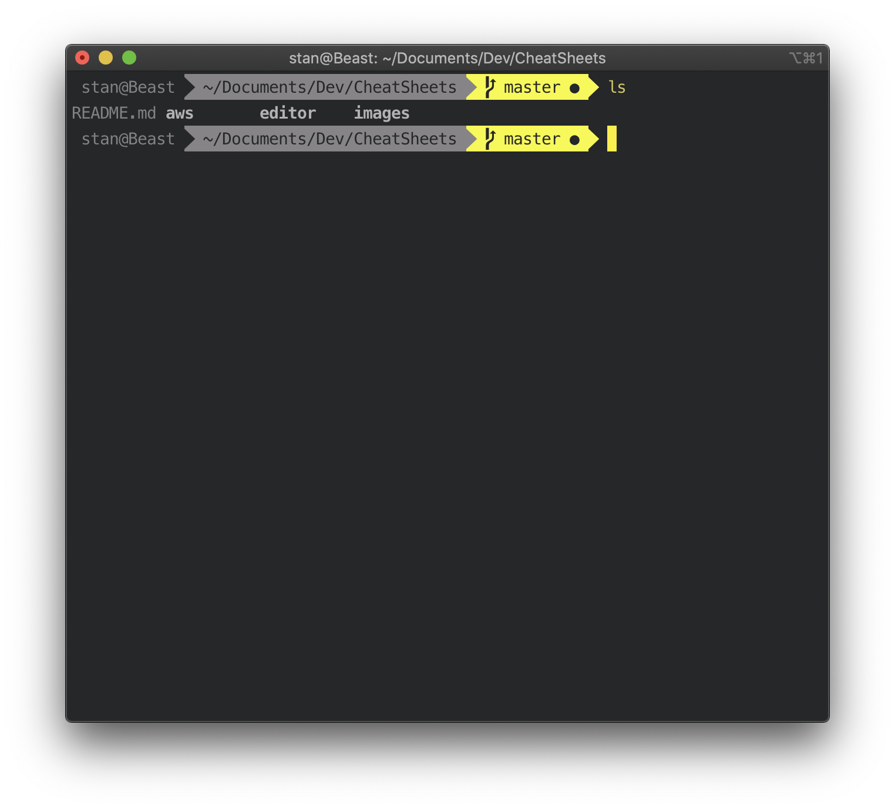

# Oh My ZSH

Probably one of the best thing I've encountered in my whole life ! 

[Oh My ZSH](https://github.com/ohmyzsh/ohmyzsh)

Oh My Zsh is an open source, community-driven framework for managing your [zsh](https://www.zsh.org/) configuration.

# Installation

Visit [Oh My ZSH](https://github.com/ohmyzsh/ohmyzsh) Github Repo for all the lastest informations on how to install

## **Go Further**

### ITerm2 users

If you want to pimp up your Oh My ZSH installation I recommend following [Jazz Up Your “ZSH” Terminal In Seven Steps](https://www.freecodecamp.org/news/jazz-up-your-zsh-terminal-in-seven-steps-a-visual-guide-e81a8fd59a38/)

Choose the Batman Theme. My favorite one so far to end up with:

