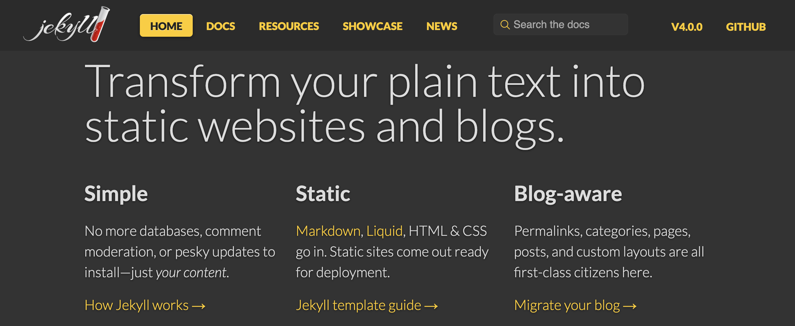

# Jekyll 

## Description 
---
[Jekyll](https://jekyllrb.com/) allows you to easily host static website to [Github Pages](https://pages.github.com/)

## Links
---

- [Website](https://jekyllrb.com/)
- [Github](https://github.com/jekyll/jekyll)

## Go Further
---

### **Awesome Jekyll's Plugins**

#### **jekyll-toc**

A GitHub Pages compatible Table of Contents generator without a plugin or JavaScript

- [Github](https://github.com/allejo/jekyll-toc)

### **List of awesome Jekyll's Theme**

#### **Just the docs**

A modern, highly customizable, and responsive Jekyll theme for documentation with built-in search.
Easily hosted on GitHub Pages with few dependencies.

[Discover here](https://github.com/pmarsceill/just-the-docs)

