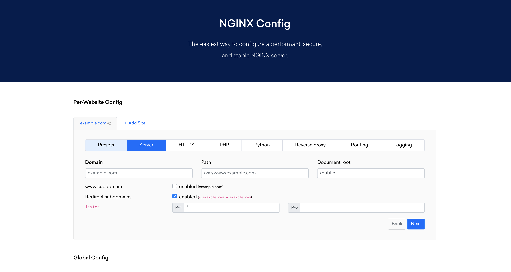

# Nginx

Nginx (pronounced "engine X") (stylized as NGINX or nginx or NginX) is a web server which can also be used as a reverse proxy, load balancer, mail proxy and HTTP cache. The software was created by Igor Sysoev and first publicly released in 2004. A company of the same name was founded in 2011 to provide support and Nginx plus paid software.

## Useful projects
---

### Nginxconfig.io
---

#### Description
NGINX configuration generator on steroids

#### Links

- [Github](https://github.com/digitalocean/nginxconfig.io)
- [Website](https://www.digitalocean.com/community/tools/nginx)

### Nginx Boilerplate
---

#### Description
Nginx Server Configs is a collection of configuration snippets that can help your server improve the web site's performance and security, while also ensuring that resources are served with the correct content-type and are accessible, if needed, even cross-domain.

#### Links

- [Github](https://github.com/h5bp/server-configs-nginx)

